# Screenshots

Visual evidence of every component deployed in the Azure Infrastructure Lab.
Screenshots are organised to follow the architecture from network foundation
through to security monitoring and storage.

---

## 1. Resource Group Overview

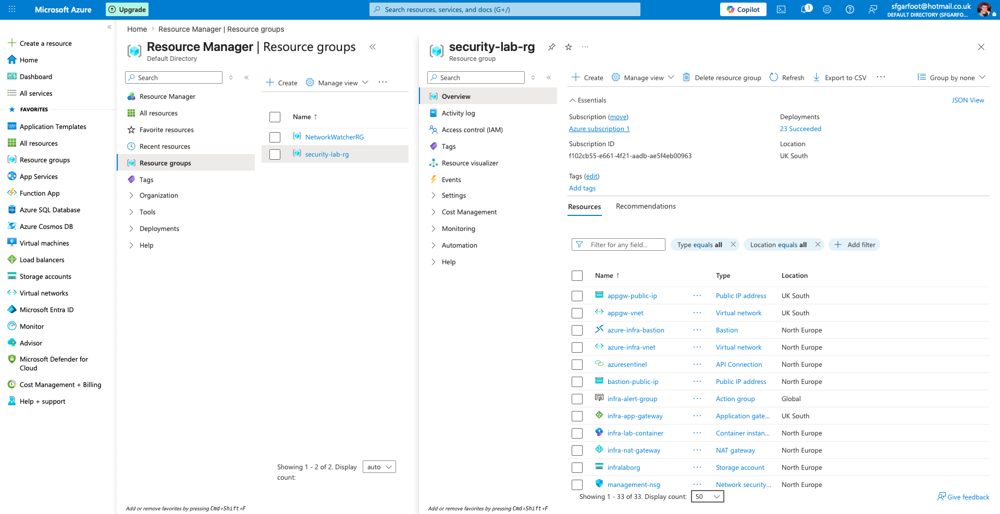

The `security-lab-rg` resource group containing all deployed resources across
the lab. This single view demonstrates the breadth of the deployment —
virtual networks, virtual machines, container instances, storage accounts,
Application Gateway, Bastion, NAT Gateway, NSGs, and monitoring resources
all deployed and managed within a single resource group. The consistent
naming convention (`infra-`, `security-lab-`, `appgw-`) reflects enterprise
tagging and naming standards.

---

## 2. Virtual Network Architecture

### Core Infrastructure VNet

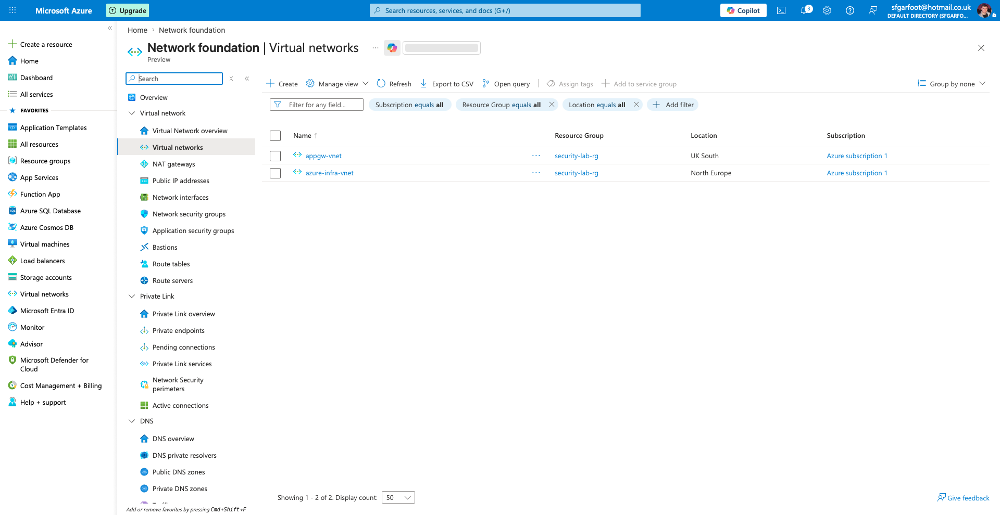

The `azure-infra-vnet` core virtual network deployed in North Europe with a
`10.0.0.0/16` address space providing 65,536 available IP addresses. This is
the primary network containing all workload subnets. The `appgw-vnet` in UK
South is also visible — the dedicated Application Gateway network deployed
in a separate region due to public IP quota constraints, demonstrating
cross-region architecture.

### Subnet Segmentation

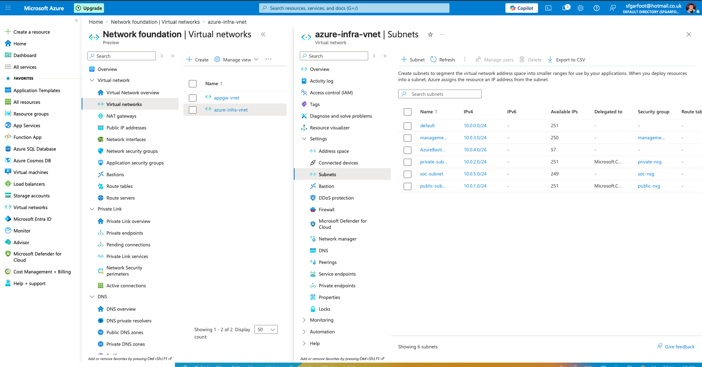

Five isolated subnets within `azure-infra-vnet`, each serving a distinct
architectural purpose. The subnet segmentation implements defence in depth —
a compromise of the public-facing tier cannot directly reach the private
application tier or management subnet without traversing additional network
controls. Key subnets:

- `public-subnet` (10.0.1.0/24) — internet-facing workloads
- `private-subnet` (10.0.2.0/24) — isolated backend, no internet access
- `management-subnet` (10.0.3.0/24) — admin access via Bastion only
- `AzureBastionSubnet` (10.0.4.0/26) — dedicated Bastion subnet
- `soc-subnet` (10.0.5.0/24) — security monitoring tier

### Application Gateway VNet

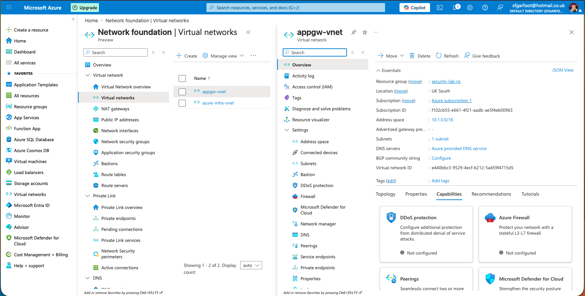

The `appgw-vnet` deployed in UK South with a `10.1.0.0/16` address space —
deliberately non-overlapping with `azure-infra-vnet` (10.0.0.0/16) to enable
VNet peering. Overlapping address spaces cannot be peered in Azure. The
dedicated `appgw-subnet` (10.1.0.0/24) hosts the Application Gateway —
Azure requires Application Gateway to have its own dedicated subnet.

---

## 3. Network Security Groups

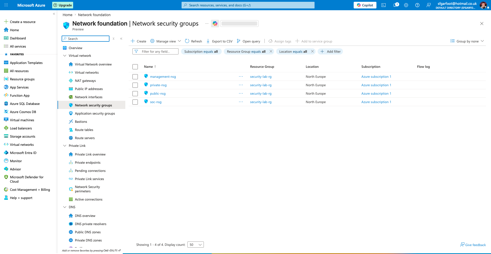

Four NSGs deployed across the lab — one per workload subnet implementing
least privilege traffic control. Each NSG is tailored to its subnet's
purpose:

- `public-nsg` — allows HTTP/HTTPS inbound from internet, blocks everything else
- `private-nsg` — allows traffic from public-subnet only, fully isolated from internet
- `management-nsg` — allows RDP/SSH from admin IP only, no public internet access
- `soc-nsg` — internal VNet traffic only, no inbound internet rules

NSGs act as the primary network-layer defence — implementing CIS Control 12
network infrastructure management and NIST CSF PR.PT-4 communications
protection.

---

## 4. NAT Gateway

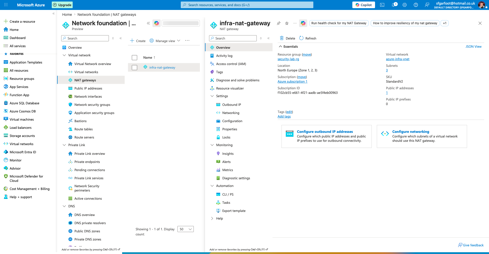

The `infra-nat-gateway` providing outbound internet connectivity for public,
management, and SOC subnets while maintaining inbound internet isolation.
All outbound traffic exits through a single managed NAT IP address —
`nat-gateway-pip`. Private subnet is deliberately excluded from the NAT
Gateway association — the application tier should never initiate outbound
internet connections. Unexpected outbound traffic from private-subnet would
be a potential indicator of compromise.

---

## 5. Application Gateway Deployment

### CLI Deployment

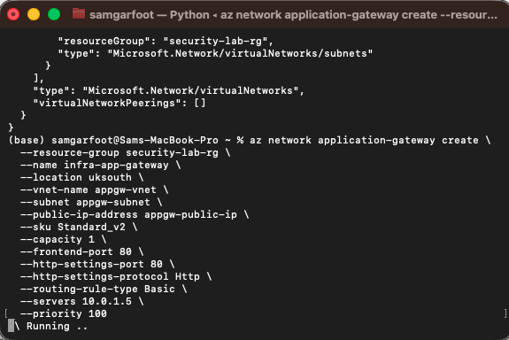

The Application Gateway Standard_v2 deployed entirely via Azure CLI — no
portal wizard used. The command creates the gateway, frontend listener,
backend pool, HTTP settings, and routing rule in a single operation. Key
parameters visible in the terminal output:

- `provisioningState: Succeeded` — deployment completed successfully
- `operationalState: Running` — gateway is active and processing traffic
- `backendAddresses: 10.0.1.5` — Nginx container registered in backend pool
- `sku: Standard_v2` — Generation 2, supports WAF add-on

### Backend Health Verification

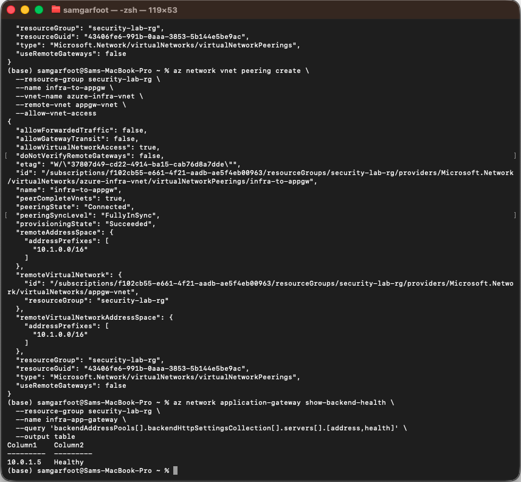

Backend health check confirming the Application Gateway can reach the Nginx
container at `10.0.1.5` across the cross-region VNet peering. This output
proves the complete traffic path is functioning:

Internet → Application Gateway (51.142.231.76) → VNet Peering → Nginx (10.0.1.5)

A healthy backend status confirms the VNet peering between UK South and
North Europe is correctly configured and traffic is flowing over the Azure
backbone network.

---

## 6. Virtual Machines

### VM Overview

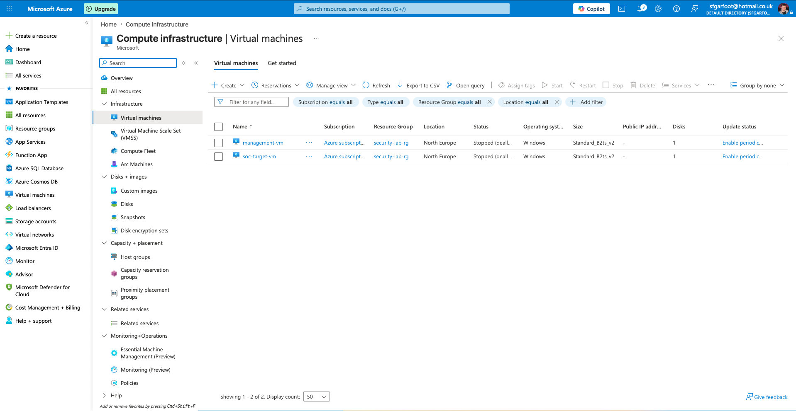

Both virtual machines deployed in North Europe within `security-lab-rg`.
Neither VM has a public IP address — all access is via Azure Bastion only.
This eliminates the most common cloud VM attack vector: exposed RDP/SSH
ports. Any internet-facing VM with port 3389 open will receive automated
brute force attempts within minutes of deployment.

### Management VM

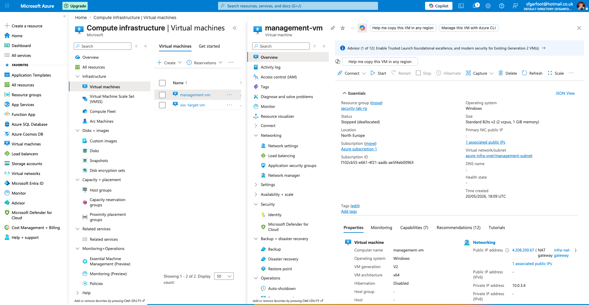

The `management-vm` jump box running Windows Server 2022 Datacenter Gen 2
in `management-subnet`. Key security configurations visible:

- No public IP address — Bastion access only
- Placed in management-subnet with dedicated NSG
- Acts as the secure entry point to reach `soc-target-vm`

Access pattern: Engineer → Azure Portal → Bastion → management-vm →
soc-target-vm. This implements a zero trust remote access model — every
session requires Entra ID MFA authentication before access is granted.

### SOC Target VM

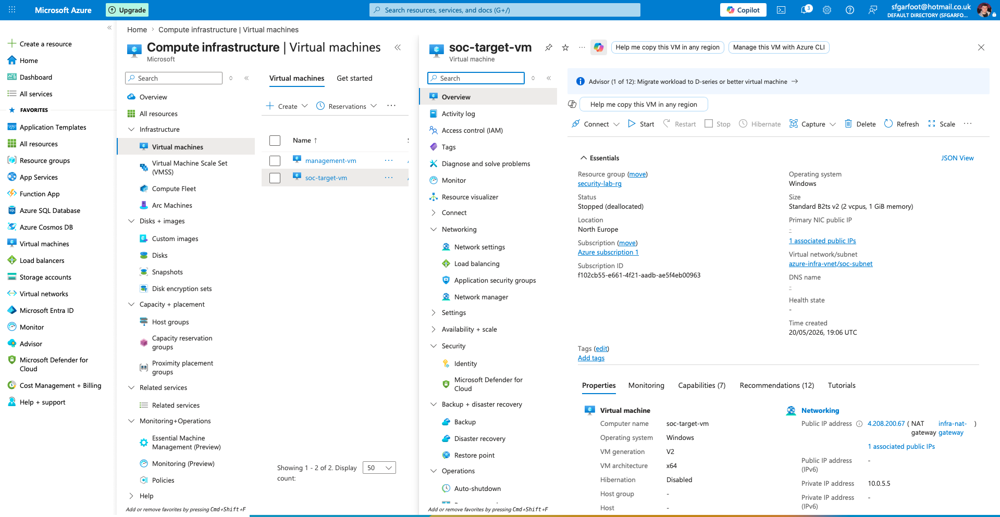

The `soc-target-vm` running Windows Server 2022 Datacenter Gen 2 in
`soc-subnet` — the primary security monitoring target. Key configurations:

- No public IP address — accessible only via management-vm jump box
- Connected to Microsoft Sentinel via Azure Monitor Agent
- Comprehensive Windows audit policy configured — logon events, privilege
  use, account management, policy changes, and process creation with full
  command line logging all captured
- Security events forwarded to `security-lab-workspace` Log Analytics
  workspace and queryable via KQL

---

## 7. Container Instances

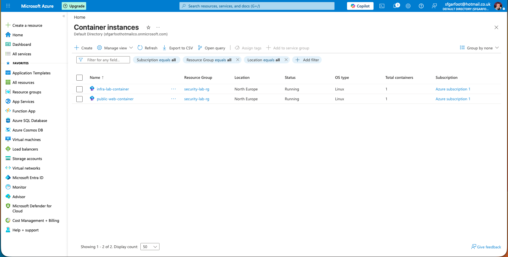

Two container instances deployed using Azure Container Instances —
a cost-efficient alternative to full VMs for workload tiers:

**public-web-container** — Nginx web server at `10.0.1.5` in public-subnet.
This is the Application Gateway backend target — all internet traffic
entering via `51.142.231.76` is routed to this container. Uses the
Microsoft Container Registry `nginx:1.9.15-alpine` image — pinned to a
specific version for reproducibility.

**infra-lab-container** — isolated application tier at `10.0.2.4` in
private-subnet. No internet access in either direction — no NAT Gateway
association, no public IP. Implements the principle that backend application
tiers should be completely isolated from direct internet access.

---

## 8. Azure Bastion

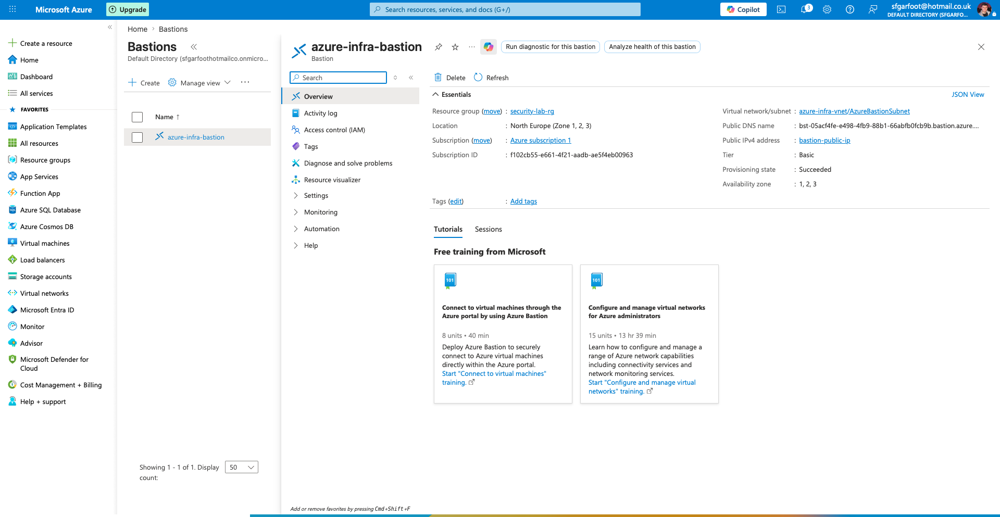

`azure-infra-bastion` deployed in the dedicated `AzureBastionSubnet`
(10.0.4.0/26) — Azure mandates a minimum /26 subnet exclusively for
Bastion, no other resources permitted in this subnet. Bastion provides
browser-based RDP and SSH access to VMs via the Azure Portal without
requiring public IPs or open RDP/SSH ports.

Security benefits demonstrated:
- Zero exposed RDP/SSH ports to the internet
- All sessions authenticated via Entra ID MFA
- Full session logging and auditing
- Implements CIS Control 4 — secure configuration, and CIS Control 6 —
  access control management

---

## 9. Security Monitoring

### Microsoft Sentinel Overview

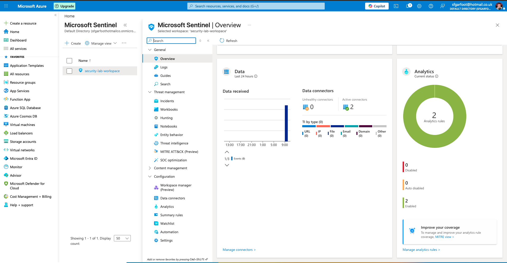

Microsoft Sentinel SIEM deployed and connected to `security-lab-workspace`
Log Analytics workspace. The Sentinel overview dashboard shows the
security posture of the environment — incidents, alerts, and data ingestion
status. Sentinel acts as the central security analytics platform, receiving
Windows Security Events from `soc-target-vm` via Azure Monitor Agent and
making them queryable via KQL for threat detection and hunting.

### Data Connectors

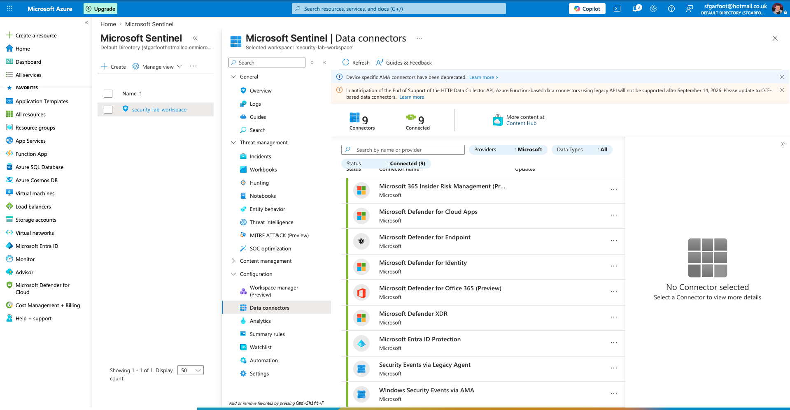

Windows Security Events via AMA (Azure Monitor Agent) data connector
showing Connected status — confirming that security events from
`soc-target-vm` are actively being ingested into the Log Analytics
workspace. The AMA connector replaces the legacy Log Analytics Agent and
uses Data Collection Rules to define exactly which event categories are
forwarded — avoiding log noise from irrelevant events. Categories
configured: Logon/Logoff, Account Management, Privilege Use, Policy
Change, System, and Process Creation with command line logging.

### KQL Log Query

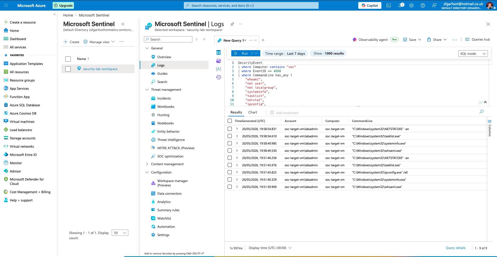

KQL query executed against the Log Analytics workspace demonstrating live
security event ingestion from `soc-target-vm`. The query surfaces Windows
Security Events from the `SecurityEvent` table — the foundation of all
detection rules configured in this lab. Example query:

```kql
SecurityEvent
| where EventID == 4625
| summarize FailedLogins=count() by Account, Computer
| order by FailedLogins desc
```

This query detects failed login attempts grouped by account and computer —
the basis of the `sentinel-failed-login-alert` configured in Azure Monitor.
All 16 detection queries in `KQL-QUERIES.md` run against this same
workspace.

---

## 10. Azure Monitor & Alerting

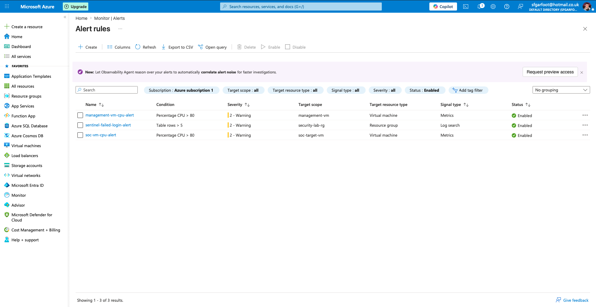

Three alert rules deployed in Azure Monitor covering both infrastructure
metric alerting and security log search alerting:

**soc-vm-cpu-alert** — metric alert firing when `soc-target-vm` average CPU
exceeds 80% over a 5 minute window, evaluated every minute. Severity 2 —
Warning. Detects resource exhaustion that could indicate cryptomining,
denial of service, or runaway processes.

**management-vm-cpu-alert** — identical CPU threshold alert on
`management-vm`. Jump box CPU spikes could indicate an attacker using the
management host as a pivot point for lateral movement or resource-intensive
operations.

**sentinel-failed-login-alert** — KQL-based log search alert firing when
more than 5 failed login events (EventID 4625) are detected within a 5
minute window. Severity 2 — Warning. Directly implements CIS Control 13.7
and maps to MITRE ATT&CK T1110 — Brute Force. All three alerts route to
`infra-alert-group` for email notification.

---

## 11. Identity & Access Control

### Resource Group RBAC

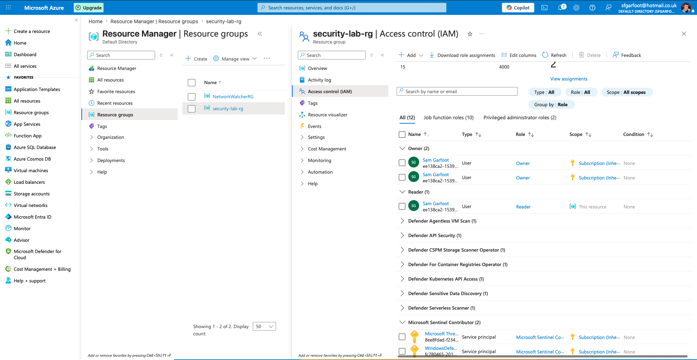

Role assignments on `security-lab-rg` demonstrating least privilege RBAC
configuration. Role assignments follow the principle of minimum required
access — roles are assigned at the most restrictive scope possible rather
than at subscription level. Key assignments:

- **Reader** — read-only access to all resources in the group
- **Network Contributor** — network management only, scoped to VNet resource

This implements CIS Control 5 account management and CIS Control 6 access
control management — no single identity has more permissions than required
for their function.

### Storage Account RBAC

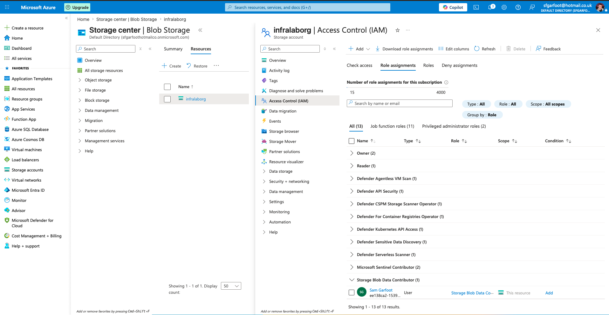

Role assignment on `infralaborg` storage account demonstrating data plane
RBAC separation. The `Storage Blob Data Contributor` role is assigned at
the storage account scope — not at resource group or subscription scope.

This highlights an important Azure RBAC concept: management plane permissions
(Owner, Contributor) do not automatically grant data plane permissions
(reading and writing blob data). Explicit data plane role assignments are
required — this is deliberate least privilege design, not a gap. An account
with Contributor at subscription level cannot read blob data without an
explicit data plane role assignment.

---

## Architecture Summary

The screenshots above provide visual evidence of a complete enterprise-grade
Azure infrastructure deployment covering all five AZ-104 exam domains:

| Domain | Screenshots |
|---|---|
| Identities & Governance | 17, 19 |
| Compute | 07, 08, 09, 10, 11 |
| Virtual Networking | 01, 02, 03, 04, 18 |
| Monitor & Maintain | 12, 13, 14, 15 |
| Storage | Covered in README — see infralaborg configuration |

All resources deployed in `security-lab-rg` — North Europe (primary) and
UK South (Application Gateway). Full CLI commands used to deploy every
resource are documented in [COMMANDS.md](COMMANDS.md).
